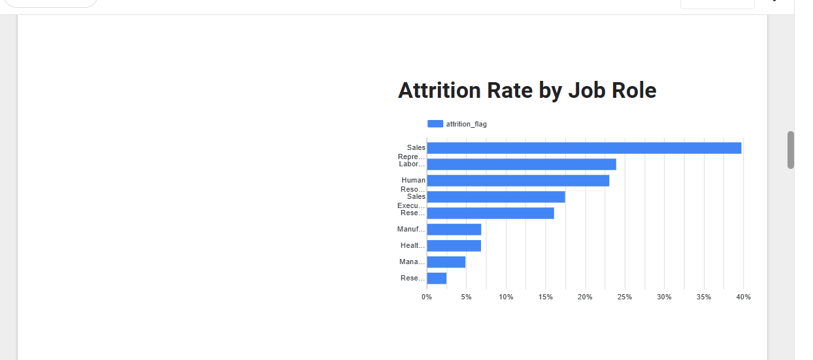
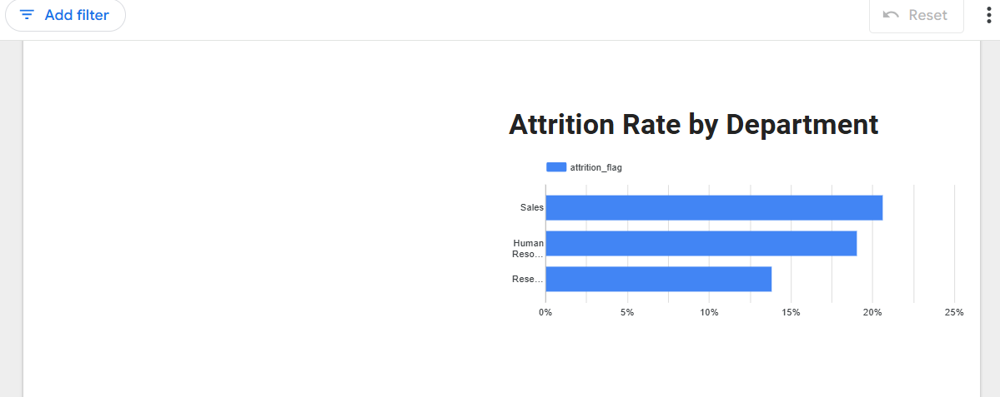
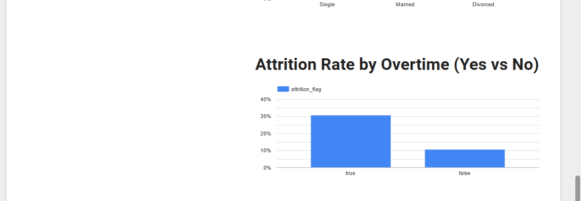

# HR Analytics: Employee Attrition Dashboard

**Overview**  
This project analyzes employee attrition using SQL, BigQuery, and Looker Studio. It explores key HR metrics, identifies drivers of employee turnover, and provides insights to support data‑driven decision‑making.

---

## Objectives
- Understand patterns and trends in employee attrition  
- Identify key factors influencing turnover  
- Build an interactive dashboard for HR leadership  
- Provide actionable recommendations to reduce attrition  

---

## Tools Used
- **SQL** (BigQuery)  
- **Looker Studio**  
- **Google Sheets**  
- **GitHub**  

---

## Project Components
- **SQL Queries:** Data cleaning, transformation, and analysis  
- **Dashboard:** Interactive visualizations and KPIs  
- **Documentation:** Insights, recommendations, and limitations  

---

## Repository Structure
- **/sql** – All SQL scripts used for cleaning and analysis  
- **/screenshots** – Dashboard images and visuals  
- **/documentation** – Project notes, findings, and supporting files  

---

## Key Insights (Summary)
- Attrition is highest among employees with lower job satisfaction  
- Younger employees and those early in their careers show higher turnover  
- Overtime and long working hours strongly correlate with attrition  
- Employees with lower monthly income are more likely to leave  

## 📊 Dashboard Screenshots

### Overall Workforce KPIs

### Attrition by Job Role

### Attrition by Department

### Overtime vs Attrition

---

## Dashboard Link## 📊 Interactive Dashboard

The interactive dashboard for this project was built using **Looker Studio** and connected directly to **Google BigQuery**.

👉 **View the dashboard here:**  
[IBM HR Attrition Dashboard (Looker Studio)(https://lookerstudio.google.com/reporting/0b76572e-8484-4c12-942d-6438d2a4b73f))

---

## Author
Nnamdi – Data Analyst  
